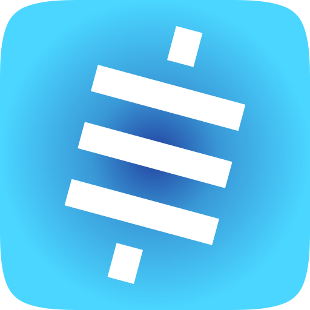
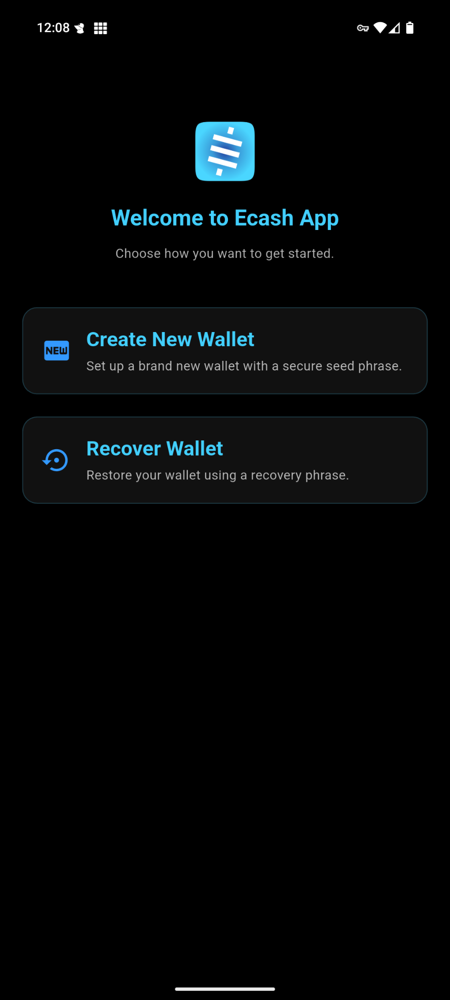
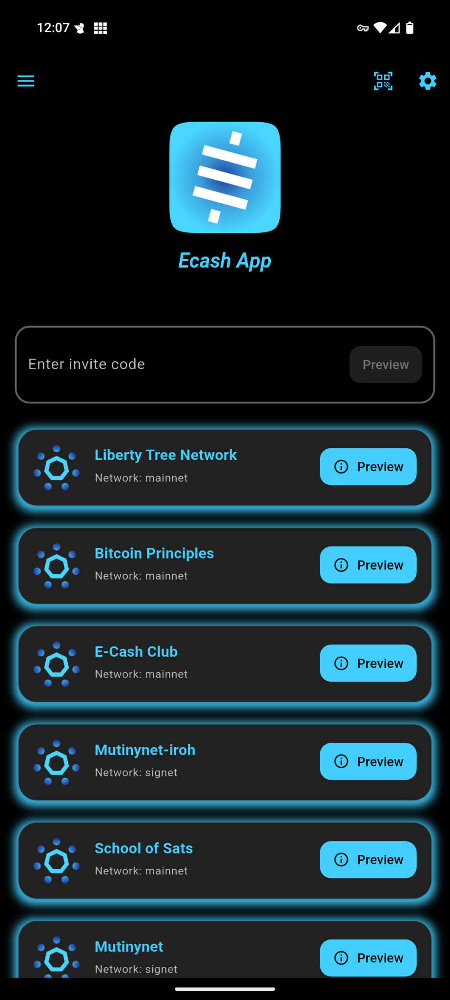

  

# Ecash App – A Fedimint Wallet

  
  

**Ecash App** is a [Fedimint](https://fedimint.org) wallet. It supports Lightning, On-chain, and Ecash payments all in one wallet. Ecash App is designed to be as transparent as possible, displaying all fees and showing the details of the wallet to the user. Users can query the registered Lightning Gateways, view the UTXOs of a federation, and view the Ecash note denominations in the wallet.
It’s built with **Flutter** for the UI and **Rust** (via [Flutter Rust Bridge](https://github.com/fzyzcjy/flutter_rust_bridge)).

---

## ✨ Features

- ₿ **Lightning, On-chain, and Ecash payments** – all in one wallet  
- ⚡ **Lightning Address** – receive payments using Lightning Address 
- 🔗 **Nostr Wallet Connect (NWC)** – connect your wallet to Nostr app and use Ecash App to zap 
- 🌐 **Federation Discovery via Nostr** – find and join federations easily  
- 🔒 **Automated Backup & Recovery** – backup all of your Ecash using a familiar seed phrase

---

## 📸 Screenshots

  
  
  
  
  
  
  
  
  

---

See [contributing](./docs/contributing.md) for getting setup with a development environment.

